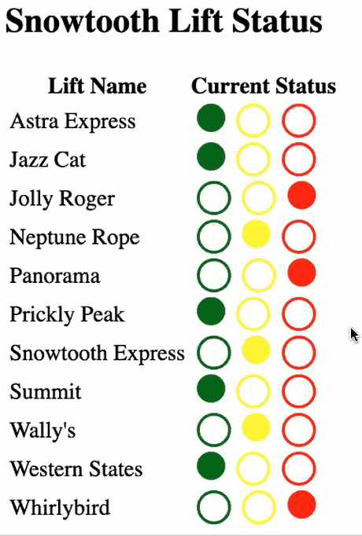

# GraphQL Course: GraphQL for React Developers

---

- **Author: Eve Porcello**
- **Workshop Recording**: https://drive.google.com/file/d/16sI_kPdwdkcaSLNsgIEQEctmNkW_y8BX/view
- **Courese Repo**: https://github.com/MoonHighway/graphql-for-react-devs
- **Topics covered**:

  - GraphQL Overview: Single endpoint
  - Understanding GraphQL Schemas
  - Setting Up Apollo Client
  - Fetching Data in React Components
    1. GraphQL Query (Get data)
    2. GraphQL mutation (Change data)
    3. GraphQL subscription (Listen for data changes in real time): how Facebook shows 'like' increases in real time.

---

### Demo

  

---

## Useful Links from Course Repo

### GraphQL Query Language

- [Query Language Slides](https://slides.com/moonhighway/graphql-intro/)
- [Snowtooth Playground](https://snowtooth.moonhighway.com)
- [Pet Library Playground](https://pet-library.moonhighway.com)
- [Moon Highway Vote Playground](http://vote.moonhighway.com)
- [Github GraphQL Explorer](https://developer.github.com/v4/explorer/)
- [Lab Instructions](https://slides.com/moonhighway/snowtooth-query-lab/)

### GraphQL Schema Definition Language

- [Slides for Reference](https://slides.com/moonhighway/schema-definition-language/)
- [Schema Design Cheat Sheet](https://github.com/sogko/graphql-schema-language-cheat-sheet)

### Example GraphQL APIs

- [Snowtooth API](https://github.com/graphqlworkshop/snowtooth-api/tree/complete)
- [Pet Library API](https://github.com/MoonHighway/pet-library)

### Apollo Client

#### Simple Requests

- curl Request

```sh
curl -X POST \
     -H "Content-Type: application/json" \
     --data '{ "query": "{allLifts{name}}" }' \
     http://snowtooth.moonhighway.com
```

- [Fetch Sample](https://codesandbox.io/s/n3jro0o4n0)
- [graphql-request](https://codesandbox.io/s/4qzq5z2vz0)

## Next Steps

- [Pet Library with Relay](https://github.com/eveporcello/pet-library-demo)
- [Fullstack Error Handling with GraphQL](https://blog.apollographql.com/full-stack-error-handling-with-graphql-apollo-5c12da407210)
- [Apollo Federation](https://egghead.io/playlists/getting-started-with-apollo-federation-60ad0165)
- [TypeScript & Apollo CLI - Finished Project + Instructions](https://github.com/graphqlworkshop/snowtooth-typescript)

---

©2020 Ellie Chen - All Rights Reserved.
